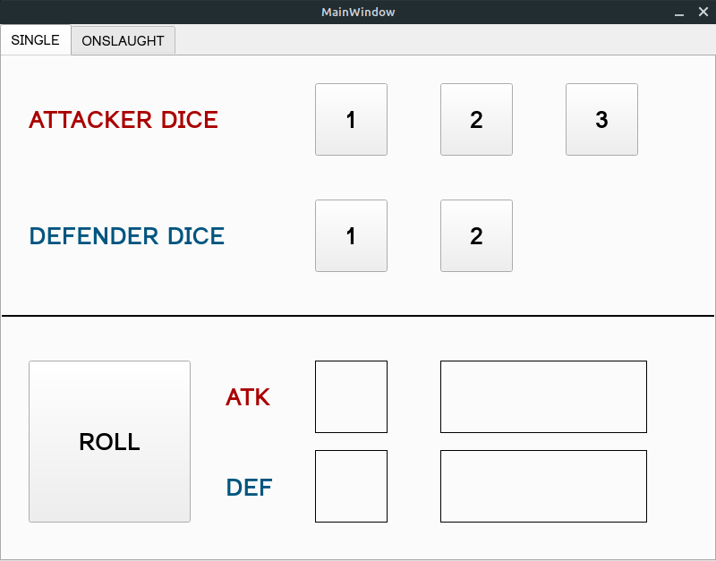
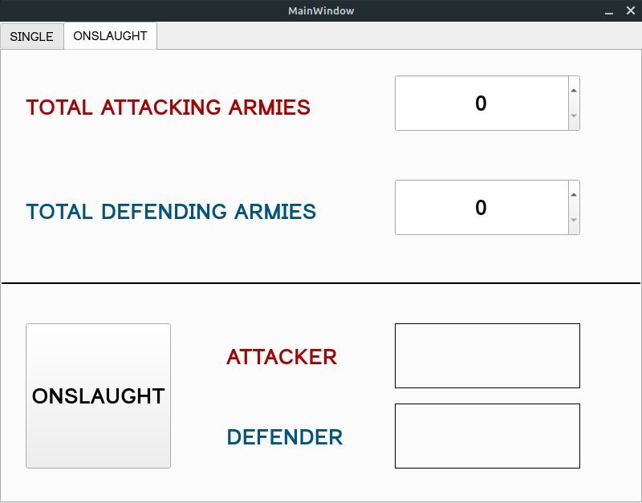

# **PRJECT OVERVIEW**

This Windows-only GUI application is a dice roll simulator for the board game "Risk". It was built with PySide6 and Qt Designer, then frozen into a standalone executable using PyInstaller. It is divided into two pages, and players can navigate between them by clicking the tabs at the top of the window ("SINGLE" and "ONSLAUGHT"). Each page contains its own unique functionality:

## **SINGLE**

This page allows players to simulate a single roll - just as if they were playing with physical dice. The players can click buttons representing the number of dice each player would like to roll (a max of 3 for the attacker and a max of 2 for the defender). Those numbers are displayed until different ones are chosen. Players can then click the "ROLL" button, which initiates a single roll and displays the resulting army losses. Pressing the "ROLL" button again clears the previous result, and releasing it initiates a new roll - and so on.

## **ONSLAUGHT**

This page represents an imitation of the "blitz" roll from the official Hasbro Risk app - "Risk: Global Domination",
which allows players to dramatically speed up the rolling process.

Players enter the total numbers of attacking and defending armies, then click the "ONSLAUGHT" button, which initiates
a cascade of rolls that only stops when one player is completely defeated (when the attacker has 1 army remaining OR
the defender has 0 armies remaining). The resulting total army losses are then displayed.

# **CONTENTS**
***
- **executable_app folder**: contains the actual executable application (**risk_dice.exe**) along with a handful of files that must be present in order for the app to run properly on Windows

- **python_script folder**: contains python files related to the app's aesthetic (**main_ui.py**) and function (**main_script.py**)

- **single_tab.png**: image of the "SINGLE" tab

- **onslaught_tab.png**: image of the "ONSLAUGHT" tab
